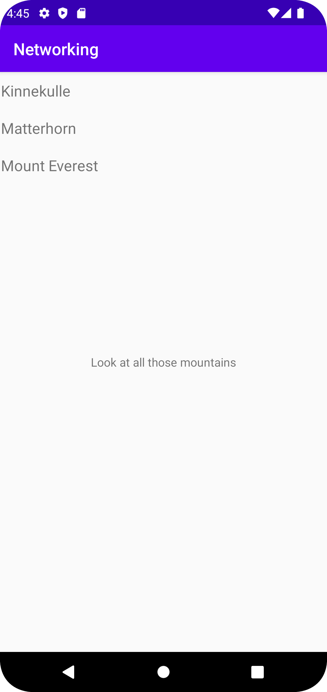

# Rapport

**Skriv din rapport här!**

Lade till en recycler view i activity_main.xml
```
    <androidx.recyclerview.widget.RecyclerView
        android:id="@+id/mountainList"
        android:layout_width="412dp"
        android:layout_height="342dp"
        app:layout_constraintEnd_toEndOf="parent"
        app:layout_constraintStart_toStartOf="parent"
        app:layout_constraintTop_toTopOf="parent" />
```

Lade till ett list item "template" för de olika objekten i recycler-view listan.
```
<?xml version="1.0" encoding="utf-8"?>
<LinearLayout xmlns:android="http://schemas.android.com/apk/res/android"
    android:layout_width="match_parent"
    android:layout_height="wrap_content"
    android:orientation="horizontal"
    android:padding="10dp">


    <TextView
        android:id="@+id/title"
        android:layout_width="wrap_content"
        android:layout_height="wrap_content"
        android:layout_weight="1"
        android:textSize="18sp" />
</LinearLayout>
```

Skapade en Mountain-klass samt dess variabler och konstruktorer.
```
package com.example.networking;

import com.google.gson.annotations.SerializedName;

public class Mountain {

    private String name;
    private String location;
    private int height;


    public Mountain(){

        name = "Saknar namn";
        location = "Saknar plats";
        height = 1;
    }

    public Mountain(String n, String l, int h){

        name = n;
        location = l;
        height = h;
    }

    public Mountain(String name){
        this.name = name;
    }

    public void setName(String n){
        name = n;
    }

    public String getName(){
        return name;
    }

    @Override
    public String toString(){
        return name;
    }
}
```

Lade till en ArrayList för min Mountain-klass, samt deklararade min RecyclerViewAdapter (skapade en recyclerviewadapter-klass genom att kopiera koden från lenaSYS).
Adaptern skriver sedan ut namnen på bergen från datan som kommer skickas in.
```
    private ArrayList<Mountain> mountainArrayList = new ArrayList<>();
    RecyclerViewAdapter adapter;
    
    adapter = new RecyclerViewAdapter(this, mountainArrayList, new RecyclerViewAdapter.OnClickListener() {
        @Override
        public void onClick(Mountain item) {
            Toast.makeText(MainActivity.this, item.getName(), Toast.LENGTH_SHORT).show();
        }
    });
    
    RecyclerView view = findViewById(R.id.mountainList);
    view.setLayoutManager(new LinearLayoutManager(this));
    view.setAdapter(adapter);
```

Implementade Gson för att kunna parse:a json-filer. Skapade? jsonfilen med hjälp av den redan existerande koden i JsonFile. I onPostExecute lades datan från JsonFilen
in i arraylistan. 
```
    Gson gson = new Gson();
    
    new JsonFile(this, this).execute(JSON_FILE);

    @Override
    public void onPostExecute(String json) {
        Log.d("MainActivity", json);

        Type type = new TypeToken<List<Mountain>>() {}.getType();
        mountainArrayList = gson.fromJson(json, type);

    }
```

(Att hämta från URL funkar inte på skoldatorerna; appen kraschar ifall man försöker, så den är inte med. Osäker på ifall den bortkommenterade koden som har med URL:en
att göra faktiskt fungerar då jag inte kunde köra appen när den raden kod var med.)
```
    //new JsonTask(this).execute(JSON_URL);
```

